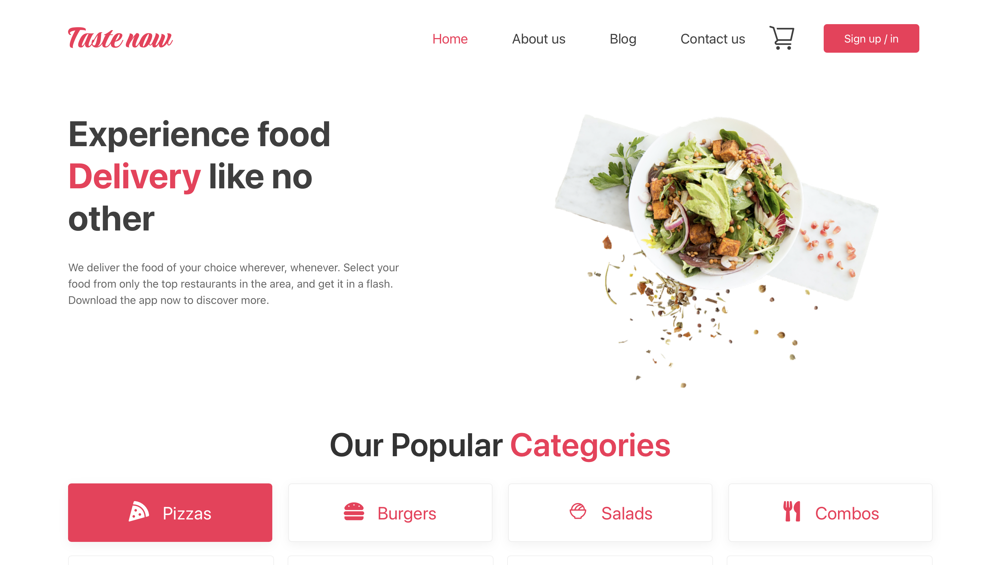
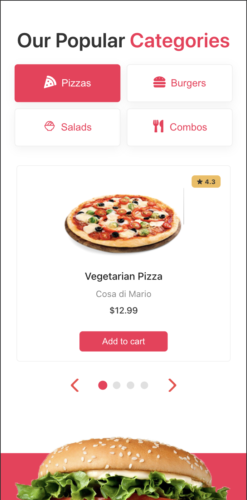
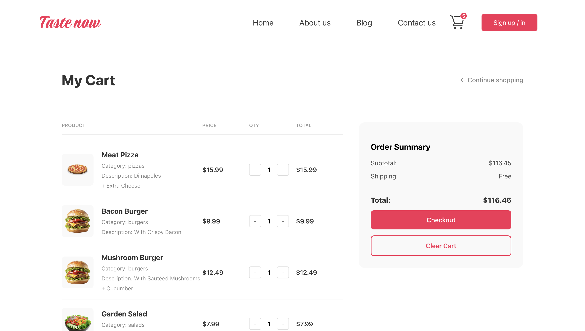

<div align="center">

  <h1>🍕 TasteNow</h1>
  
  <p>
    <b>Сучасний та адаптивний веб-сервіс для доставки їжі</b>
  </p>

  <p>
    
    
    
    
  </p>
  
  <p>
    <a href="#встановлення">Про проєкт</a> •
    <a href="#функціонал">Функціонал</a> •
    <a href="#скріншоти">Скріншоти</a> •
    <a href="#структура">Структура</a>
  </p>
</div>

---

## 📖 Про проект

**TasteNow** — це Single Page Application (SPA), розроблений для імітації повного циклу замовлення їжі. Проект демонструє навички роботи з сучасною екосистемою React, управлінням станом через Redux Toolkit та інтеграцією з хмарними сервісами Firebase.

Особлива увага приділена **UX/UI дизайну** та **адаптивності** — додаток виглядає чудово як на великих моніторах, так і на мобільних телефонах.

## ✨ Функціонал

*   🔐 **Авторизація:** Реєстрація та вхід користувачів (Firebase Auth).
*   🛒 **Розумний кошик:** Додавання/видалення товарів, зміна кількості, підрахунок загальної суми. Стан зберігається при перезавантаженні.
*   📱 **Адаптивність:** Mobile-first підхід. Повністю адаптивне меню, слайдери та сітки товарів.
*   🔍 **Фільтрація:** Сортування страв за категоріями (Піца, Бургери, Салати тощо).
*   🎨 **UI Компоненти:** Кастомні слайдери (Swiper), модальні вікна, анімовані кнопки.
*   ⚠️ **Обробка помилок:** Сторінка 404, валідація форм.

## 📸 Скріншоти

| Головна сторінка (Desktop) | Мобільна версія | Кошик |
|:---:|:---:|:---:|
|  |  |  |

## 📂 Структура проекту

```text
src/
├── assets/          # Зображення, іконки та глобальні стилі
├── auth/            # Логіка авторизації
├── components/      # Перевикористовувані UI компоненти (Button, Header, Card)
├── features/        # Компоненти зі складною логікою
├── hooks/           # Кастомні хуки (useResponsive, etc.)
├── redux/           # Redux: slices та конфігурація store
├── screens/         # Сторінки додатку (Home, Cart, AboutUs, NotFound)
├── firebase.js      # Конфігурація Firebase
├── App.js           # Головний компонент та роутинг
└── index.js         # Точка входу
